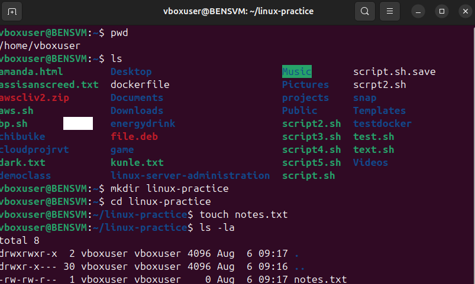
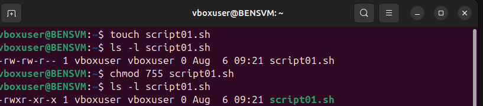
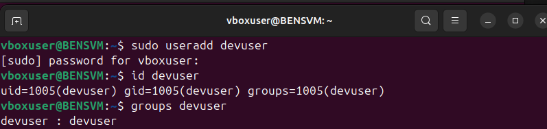
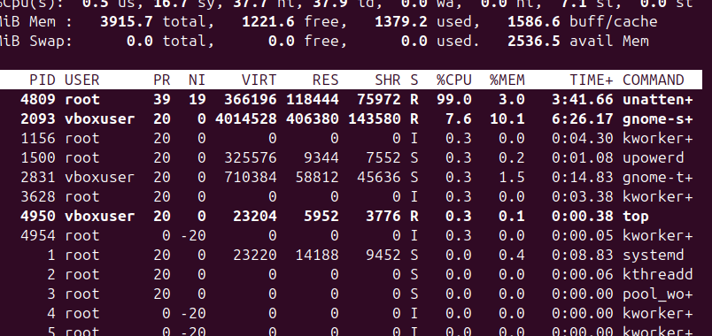
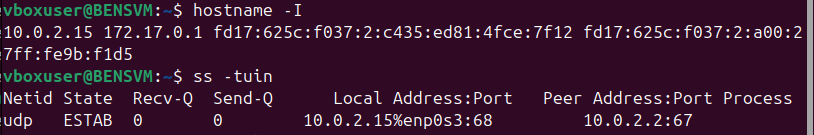

# Linux Server Administration

## Overview

This repository documents my hands-on journey learning Linux server administration as part of my Cloud and DevOps engineering portfolio. It contains practical commands, explanations, and exercises covering the essential skills required to manage Linux servers in real-world environments.

The goal of this project is to build a solid foundation in Linux, which is one of the core technologies used by Cloud Engineers, DevOps Engineers, and Site Reliability Engineers (SREs).

---

## Objectives

* Learn essential Linux commands
* Understand the Linux file system
* Manage files and directories
* Work with file permissions and ownership
* Manage users and groups
* Install and manage software packages
* Monitor system resources
* Work with networking commands
* Automate tasks using Bash scripting

---

## Technologies Used

* Ubuntu Linux
* Bash
* Git
* GitHub
* Virtual Machine (VM)

---

## Topics Covered

### 1. Basic Linux Commands

* pwd
* ls
* cd
* mkdir
* rmdir
* touch
* cp
* mv
* rm
* cat
* clear
* history

### 2. File Permissions

* chmod
* chown
* chgrp
* Permission types (Read, Write, Execute)

### 3. User & Group Management

* useradd
* passwd
* usermod
* userdel
* groupadd
* groupdel

### 4. Package Management

* apt update
* apt upgrade
* apt install
* apt remove
* apt autoremove

### 5. Process Management

* ps
* top
* htop
* kill
* killall

### 6. Disk Management

* df -h
* du -sh
* lsblk
* mount

### 7. Networking

* ip
* ping
* ss
* curl
* wget

### 8. Bash Scripting

* Variables
* Conditional statements
* Loops
* Functions
* Script execution

---

## Project Structure

```text
linux-server-administration/
│
├── basic-linux-commands/
├── file-permissions/
├── users-and-groups/
├── package-management/
├── process-management/
├── disk-management/
├── networking/
├── bash-scripting/
├── screenshots/
│   ├── linux-terminal.png
│   ├── file-permission-changes.png
│   ├── user-creation.png
│   ├── package-installation.png
│   ├── running-processes.png
│   └── network-configuration.png
└── README.md
```

---

## Screenshots

This section contains screenshots demonstrating important tasks completed during this project.

## Screenshots

### Linux Terminal


### File Permission Changes


### User Creation


### Package Installation


### Running Processes


### Network Configuration


---

## Skills Demonstrated

* Linux command line proficiency
* Linux server management
* System administration
* User and permission management
* Package management
* Networking fundamentals
* Bash scripting
* Git version control

---

## Lessons Learned

Through this project, I gained practical experience using Linux in a server environment. I became comfortable navigating the command line, managing users, configuring permissions, installing software, monitoring system resources, and writing basic Bash scripts.

---

## Future Improvements

* Add advanced Bash scripting examples
* Configure SSH authentication
* Automate server setup
* Learn systemd service management
* Add log management examples
* Configure firewall rules
* Practice server hardening

---

## Author

**GitHub Portfolio:** *(https://github.com/Divis-Ben)*

Cloud & DevOps Engineer | Linux | AWS | Docker | Terraform | GitHub Actions

